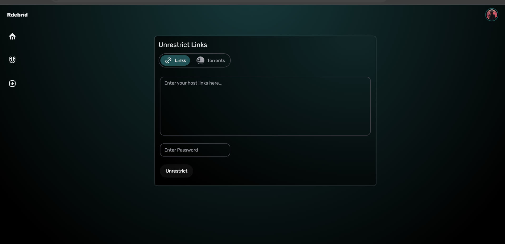
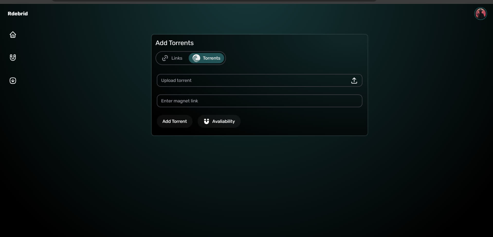
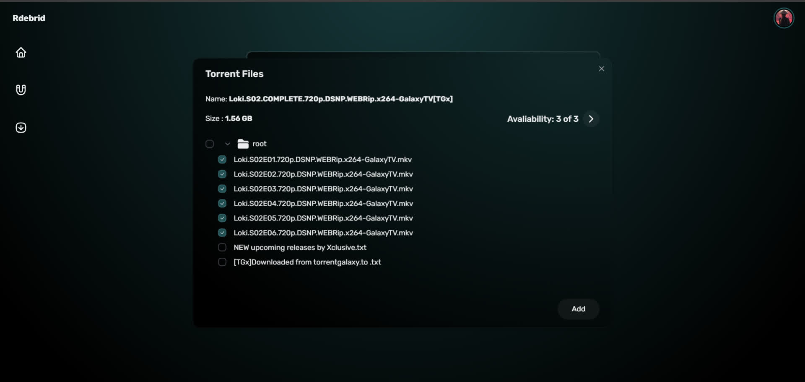

# Real-Debrid Modern UI

 Real-Debrid Modern UI! This project provides a modern interface for Real-Debrid with new features such as bulk delete,availability checking and many more.

## Features

- **Modern Interface**: A clean and modern interface for Real-Debrid.
- SPA (Single Page Application): The app is a single page application, which means it's fast and responsive.
- **Bulk Delete**: Easily delete multiple items at once.
- **Torrent Availability Checking**: Check the availability of magnet before adding torrent.
- **Tor2Magnet**: Convert Torrent files to Magnet no need of any external tool.



<details>
<summary><b>More Images</b></summary>




</details>

## Prerequisites

Ensure you have the following installed on your system:
- [Docker](https://www.docker.com/get-started)

## Getting Started

### Deploy With Docker

Use docker-compose to run the application.Change the environment variables in the docker-compose file.

```yml
services:
  realdebrid:
    image: ghcr.io/tgdrive/rdebrid-ui
    container_name: realdebrid
    ports:
    - 8080:8080
    environment:
      - AUTH_SECRET=""
      - AUTH_URL=""
      - AUTH_REAL_DEBRID_ID=""
      - AUTH_REAL_DEBRID_SECRET=""
    restart: always
    
```

### Deploy With Cloudflare Pages
- Fork this repository.
- Create a new Cloudflare Pages project and connect it to your forked repository.
- Add `pnpm build:client` as the build command.
- Add `build/client` in Build output.
- Add Environment Variables in the Cloudflare Pages settings.
- Deploy the project.

**Note**: `AUTH_REAL_DEBRID_ID` and `AUTH_REAL_DEBRID_SECRET` are required for Real-Debrid authentication. It will be generated through UI when you login first time make sure you copy those and use it here.Its a one time process.
## Environment Variables

The application requires the following environment variables:

| Variable                   | Description                                                |
|----------------------------|------------------------------------------------------------|
| `AUTH_SECRET`              | The secret key used for JWT authentication.                    |
| `AUTH_URL`                 | The Hosted URL of service.                     |
| `AUTH_REAL_DEBRID_ID`     | OAUTH ID for Real-Debrid authentication.                |
| `AUTH_REAL_DEBRID_SECRET`  | OAUTH SECRET for Real-Debrid authentication.   
| `FORWARD_IP`  | Forward Debrid IP.
| `DEBRID_TOKEN`  | Use Personal Debrid Token instead of Oauth Token which has limited scopes permissions .
| `PORT`  | Change Default 8080 Server Port. 

**You can generate `AUTH_SECRET` from [here](https://generate-secret.vercel.app/64).**

**Note**: You must enter registered real debrid IP  in  `FORWARD_IP` if you are deploying app remotely.Registered IP can be found in Real-Debrid account settings.

Sample `.env` file:

```bash
AUTH_SECRET=secret
AUTH_URL=http://localhost:8080/api/auth #Make sure to add /api/auth at the end
AUTH_REAL_DEBRID_ID=123456
AUTH_REAL_DEBRID_SECRET=secret
```
